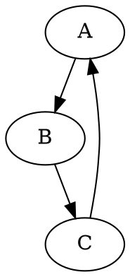
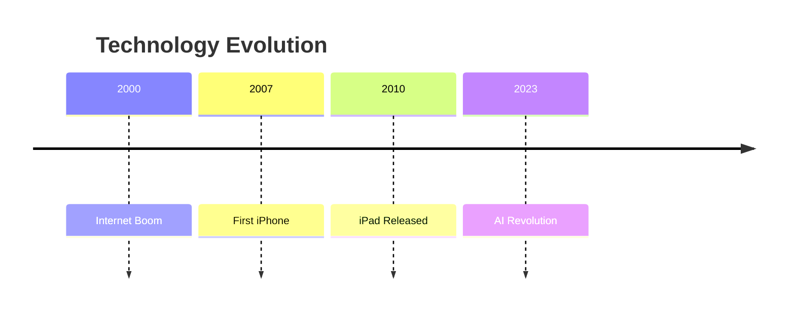
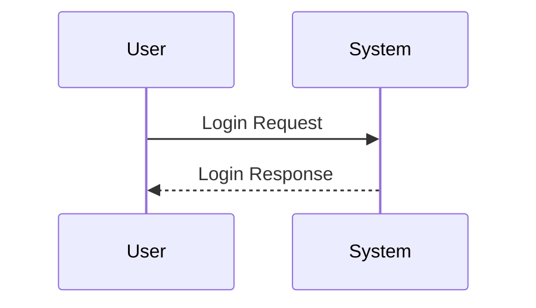

# Advanced Markdown Showcase
## A Complete Example of Extended Markdown Features

### 1. ASCII Art Diagram
```ascii
    +------------------+
    |                  |
    |  Markdown Rules  |
    |                  |
    +------------------+
```

### 2. Definition Lists
Term 1
: This is the first definition

Term 2
: This is the second definition

### 3. Keyboard Keys
Press <kbd>Ctrl</kbd> + <kbd>C</kbd> to copy and <kbd>Ctrl</kbd> + <kbd>V</kbd> to paste

### 4. Subscript and Superscript
Water is H<sub>2</sub>O
The equation is E = mc<sup>2</sup>

### 5. Color Swatches
Here are some colors: `#FF0000` `#00FF00` `#0000FF`

### 6. Diff Blocks
```diff
+ This line was added
- This line was removed
! This line was modified
# This line is commented
```

### 7. Graphviz Diagram


### 8. Chemical Formula
When supported: $\\ce{H2SO4}$

### 9. Music Notation
```abc
X:1
T:Simple Melody
M:4/4
L:1/4
K:C
CDEF|GABc|
```

### 10. Timeline Chart


### 11. Callouts
> [!NOTE]
> This is an important note

> [!WARNING]
> This is a critical warning

### 12. Iframe Example
<iframe src="https://example.com" width="600" height="400" frameborder="0"></iframe>

### 13. Sequence Diagram


### 14. Mind Map
```markmap
# Main Concept
## Branch 1
### Sub-Branch 1.1
### Sub-Branch 1.2
## Branch 2
### Sub-Branch 2.1
### Sub-Branch 2.2
```

### 15. Railroad Diagram
```railroad
Diagram(
  Sequence(
    'START',
    Choice(0,
      'Path A',
      'Path B',
      'Path C'
    ),
    'END'
  )
)
```

### Regular Markdown Features

#### Standard Text Formatting
**Bold Text**
*Italic Text*
~~Strikethrough~~
`Inline Code`

#### Lists
1. Ordered Item 1
2. Ordered Item 2
   - Unordered Sub-item
   - Another sub-item

#### Links and Images
[Visit OpenAI](https://www.openai.com)


#### Tables
| Header 1 | Header 2 |
|----------|----------|
| Cell 1   | Cell 2   |
| Cell 3   | Cell 4   |

#### Blockquotes
> This is a standard blockquote
> It can span multiple lines

#### Code Blocks
```python
def hello_world():
    print("Hello, World!")
```

---
*Note: Not all features may be supported in every Markdown processor or platform. Check your specific platform's documentation for supported features.*
